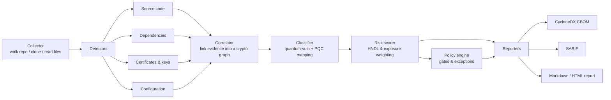

# cryptarium — Design

Architecture and implementation contracts for v0.1. This document is the authority on *how* the tool is built; [README.md](README.md) covers *what* it does and why. Where this document and an agent's instinct disagree, this document wins — and if this document is wrong, change it in the same PR that changes the code.

**Design principles, in priority order:**

1. **Deterministic core.** The same input produces byte-identical output. Anything probabilistic is an optional, clearly-labeled annotation layer that never originates a finding.
2. **Narrow stage contracts.** Each pipeline stage takes one type and returns another. Stages are independently testable and know nothing about their neighbors' internals.
3. **Never overstate.** A finding records its evidence and its confidence. Static analysis cannot prove a code path is reachable in production; the output must never imply that it can.
4. **Additive extension.** New languages, libraries, and formats arrive as YAML and fixtures. Engine changes are a last resort.
5. **Fast enough to be a habit.** A scan of a typical service repository finishes in seconds. If it needs a coffee break, it will not run in CI.

---

## 1. Pipeline



Data flows one way. No stage reaches backwards. Concretely:

```
Target → []FileRef → []CryptoFinding → *CryptoGraph → []CryptoAsset → []ScoredAsset → PolicyResult → artifacts
```

## 2. Package layout

```
cryptarium/
├── cmd/cryptarium/         # CLI entrypoint; flag parsing only, no logic
├── internal/
│   ├── collector/          # tree walk, git clone, ignore rules, file typing
│   ├── detector/           # Detector interface + registry
│   │   ├── source/         # rule-pack source scanning (tree-sitter)
│   │   ├── deps/           # manifest / lockfile parsing
│   │   ├── certs/          # X.509 / key parsing
│   │   └── config/         # TLS / SSH / JWT config parsing
│   ├── model/              # CryptoFinding, CryptoAsset, Evidence — no deps
│   ├── correlate/          # evidence graph construction
│   ├── classify/           # quantum-vuln class + PQC mapping
│   ├── score/              # four-axis risk scoring
│   ├── policy/             # declarative gates and exceptions
│   ├── rules/              # rule-pack loader, schema validation
│   └── report/             # cbom / sarif / markdown / json reporters
├── rules/                  # community-contributable YAML rule packs
├── testdata/               # fixture repos, sample certs, golden files
├── .devcontainer/
├── .github/workflows/
├── AGENT.md
├── DESIGN.md
├── README.md
└── LICENSE                 # Apache-2.0
```

**Dependency rule:** `model` imports nothing from the project. Everything imports `model`. No cycles, and no package imports a sibling stage — the pipeline is wired in `cmd/` and in an `internal/pipeline` orchestrator, not by stages calling each other.

## 3. Core types (`internal/model`)

These are the contracts. Changing them is a breaking change and needs a note in the PR description.

```go
package model

// Evidence records where a finding came from. Every finding has at least one.
type Evidence struct {
    Source     SourceKind `json:"source"`               // source-code | dependency | certificate | configuration
    Path       string     `json:"path"`                 // repo-relative, always forward slashes
    Line       int        `json:"line,omitempty"`       // 1-based; 0 when not line-addressable
    Column     int        `json:"column,omitempty"`
    Snippet    string     `json:"snippet,omitempty"`    // redacted; never contains key material
    RuleID     string     `json:"ruleId,omitempty"`     // the rule that fired, for auditability
    Confidence Confidence `json:"confidence"`           // high | medium | low
}

type SourceKind string

const (
    SourceCode          SourceKind = "source-code"
    SourceDependency    SourceKind = "dependency"
    SourceCertificate   SourceKind = "certificate"
    SourceConfiguration SourceKind = "configuration"
)

// CryptoFinding is what a detector emits. Raw, unclassified, unscored.
type CryptoFinding struct {
    ID         string            `json:"id"`         // deterministic; see §9
    AssetType  AssetType         `json:"assetType"`  // algorithm | certificate | key | protocol | library
    Primitive  string            `json:"primitive"`  // canonical name: "RSA", "ECDSA", "AES", "SHA-256"
    Parameters map[string]any    `json:"parameters"` // keySize, curve, mode, padding...
    Functions  []CryptoFunction  `json:"functions"`  // keygen | encrypt | decrypt | sign | verify | keyexchange | digest
    Evidence   Evidence          `json:"evidence"`
}

// CryptoAsset is a classified, deduplicated finding, post-correlation.
type CryptoAsset struct {
    CryptoFinding
    QuantumClass   QuantumClass `json:"quantumClass"`   // broken | weakened | safe | unknown
    Rationale      string       `json:"rationale"`      // why: "factoring; broken by Shor's algorithm"
    Recommendation Migration    `json:"recommendation"`
    RelatedIDs     []string     `json:"relatedIds"`     // correlated findings
    OID            string       `json:"oid,omitempty"`  // for CBOM emission
}

type QuantumClass string

const (
    ClassBroken   QuantumClass = "broken"   // Shor: RSA, DH, ECDH, ECDSA, EdDSA, DSA
    ClassWeakened QuantumClass = "weakened" // Grover: symmetric ciphers and hashes below target margin
    ClassSafe     QuantumClass = "safe"     // standardized PQC, or symmetric/hash at adequate size
    ClassUnknown  QuantumClass = "unknown"  // detected but unresolvable — report, never guess
)

type Migration struct {
    Target   string `json:"target"`   // "ML-KEM-768"
    Standard string `json:"standard"` // "FIPS 203"
    Hybrid   string `json:"hybrid,omitempty"` // "X25519+ML-KEM-768"
    Notes    string `json:"notes,omitempty"`
}

// ScoredAsset adds prioritization. See §7.
type ScoredAsset struct {
    CryptoAsset
    Risk RiskScore `json:"risk"`
}

type RiskScore struct {
    Score          int      `json:"score"`    // 0-100
    Priority       Priority `json:"priority"` // critical | high | medium | low
    Vulnerability  int      `json:"vulnerability"`  // axis subscores, 0-100 each
    Longevity      int      `json:"longevity"`
    Exposure       int      `json:"exposure"`
    Agility        int      `json:"agility"`
    Explanation    string   `json:"explanation"`    // human-readable derivation
}
```

**`ClassUnknown` is load-bearing.** When a detector sees crypto it cannot resolve — an unrecognized OID, a dynamically-selected algorithm, an opaque wrapper — it emits `unknown` with the evidence. It never guesses and never drops the finding. Silent omission is the worst failure mode this tool has: a user who trusts an incomplete inventory is worse off than one who has no inventory.

## 4. Detector interface

```go
package detector

type Detector interface {
    // Name is stable and appears in output. Lowercase, hyphenated.
    Name() string

    // Handles reports whether this detector wants the file. Cheap:
    // extension and basename checks only, no file reads.
    Handles(f collector.FileRef) bool

    // Detect parses one file and emits findings. Must be pure with respect
    // to the file contents, goroutine-safe, and free of global state.
    // A parse failure returns findings-so-far plus an error; it never panics
    // and never aborts the scan.
    Detect(ctx context.Context, f collector.FileRef) ([]model.CryptoFinding, error)
}
```

Detectors register themselves in an init-time registry. Adding one is a new package plus one registry line — no changes to the pipeline.

**Per-detector notes**

| Detector | Approach | Gotchas |
|---|---|---|
| `certs` | `crypto/x509` for PEM/DER; `software.sslmate.com/src/go-pkcs12` for `.p12`; SSH keys via `golang.org/x/crypto/ssh`. Extract signature algorithm, public-key algorithm, key size, curve, validity, issuer. | Java `.jks` needs a third-party reader; defer to a roadmap item rather than shipping a half-parser. **Never log or emit private key bytes** — extract metadata and discard. |
| `deps` | Parse `go.mod`/`go.sum`, `requirements.txt`, `poetry.lock`, `package-lock.json`, `pom.xml`, `Cargo.toml` against `rules/libraries/*.yaml`. | A dependency's presence is `Confidence: medium` — a library in the graph is not proof of use. Correlation with a source finding is what raises it to high. |
| `source` | tree-sitter parse, then match rule-pack patterns against the AST. Regex fallback when no grammar is available. | Requires CGO. Comments, string literals, and test files must be distinguishable — that distinction is what keeps the false-positive rate survivable. |
| `config` | Format-aware where possible (nginx, sshd_config, YAML, JSON, TOML); pattern matching otherwise. | Cipher-suite strings are the highest-yield target: one line can contain several primitives, each of which is a separate finding. |

## 5. Rule-pack schema

The primary contribution surface. A rule pack is YAML in `rules/`, validated at load time against a JSON Schema in `rules/schema.json`. Adding a library or language idiom must never require Go changes.

```yaml
# rules/go/stdlib-crypto.yaml
id: go-stdlib-crypto
version: 1
language: go
description: Go standard library cryptographic primitives.

rules:
  - id: go.crypto.rsa.generatekey
    primitive: RSA
    assetType: algorithm
    functions: [keygen]
    confidence: high
    match:
      kind: call
      package: crypto/rsa
      symbol: GenerateKey
    parameters:
      keySize:
        from: argument
        index: 1              # rsa.GenerateKey(rand.Reader, 2048)
        type: int
    references:
      - "https://pkg.go.dev/crypto/rsa#GenerateKey"

  - id: go.crypto.tls.ciphersuite.aes128
    primitive: AES
    assetType: algorithm
    functions: [encrypt, decrypt]
    confidence: medium
    match:
      kind: identifier
      pattern: 'TLS_.*_WITH_AES_128_.*'
    parameters:
      keySize: { value: 128 }
```

```yaml
# rules/libraries/catalog.yaml — dependency detector input
libraries:
  - name: github.com/ThalesIgnite/crypto11
    ecosystem: go
    primitives: [RSA, ECDSA, AES]
    notes: PKCS#11 wrapper; actual primitives are runtime-selected.
    confidence: low
  - name: cryptography
    ecosystem: pypi
    primitives: [RSA, ECDSA, AES, ChaCha20, SHA-256]
    confidence: medium
```

**Rule invariants** (enforced by `make lint-rules`, and by a test that fails CI):

- `id` is globally unique and stable. Renaming an ID is a breaking change to users' SARIF baselines and suppressions.
- Every rule has at least one positive and one negative fixture in `testdata/rules/<rule-id>/`.
- `confidence` is honest: `high` only when the match alone establishes the primitive and its parameters.
- `primitive` uses canonical names from `internal/classify/canonical.go`. A new primitive means a classifier entry, not a free-text string.

## 6. Classification

`internal/classify` is a pure function: `CryptoFinding → CryptoAsset`. No I/O, no clock, no network. It is table-driven, and the table is the tool's core knowledge claim, so it carries citations.

```go
var quantumClassification = map[string]classification{
    "RSA":   {class: ClassBroken, rationale: "integer factorization; broken by Shor's algorithm",
              migration: Migration{Target: "ML-KEM-768 (key establishment) / ML-DSA-65 (signatures)",
                                   Standard: "FIPS 203 / FIPS 204",
                                   Hybrid: "X25519+ML-KEM-768"}},
    "ECDSA": {class: ClassBroken, rationale: "elliptic-curve discrete log; broken by Shor's algorithm",
              migration: Migration{Target: "ML-DSA-65", Standard: "FIPS 204",
                                   Notes: "SLH-DSA (FIPS 205) where a conservative hash-based option is preferred"}},
    // AES and hash classification is parameter-dependent — see classifySymmetric.
}
```

Symmetric and hash classification depends on parameters, so it is a function rather than a table lookup: AES-128 is `weakened` (Grover halves the effective margin), AES-256 is `safe`; SHA-256 is `weakened` in high-assurance contexts and `safe` otherwise, which is a judgment the risk scorer refines with exposure context; SHA-1, MD5, and 3DES are `broken` classically and reported as already-broken regardless of quantum considerations.

**Never invent a classification.** If a primitive is not in the table, the result is `ClassUnknown` with the evidence attached. Adding a table entry requires a citation to FIPS, NIST SP, or CNSA 2.0 in the code comment.

## 7. Risk scoring

`internal/score` turns a classified asset into a 0–100 score and a priority. The formula must be inspectable, explainable in one sentence per finding, and stable across runs.

```
score = 0.40·vulnerability + 0.25·longevity + 0.25·exposure + 0.10·agility
```

| Axis | 100 | 50 | 0 |
|---|---|---|---|
| **Vulnerability** | broken (Shor) or classically broken | weakened (Grover) | safe / PQC |
| **Longevity (HNDL)** | data retained >10y, or a signing key with a long-lived trust anchor | months to years | ephemeral (session keys, nonces) |
| **Exposure** | internet-facing, data in transit, or code-signing | internal service-to-service | test fixture, example, dead code |
| **Agility** | hardcoded primitive, no abstraction | behind a thin wrapper | behind a provider/registry interface |

Priority bands: `critical ≥ 80`, `high ≥ 60`, `medium ≥ 35`, `low` below that.

Longevity and exposure cannot be read off a source line. v0.1 infers them from path and context heuristics (a `testdata/` or `_test.go` path drops exposure hard; a certificate with a ten-year validity raises longevity; an nginx or ingress config raises exposure) and records in `Explanation` exactly which heuristic fired. When no signal exists, the axis defaults to 50 and says so. Inventing precision the evidence does not support is worse than a visible default.

This is the layer where a threat-informed perspective earns its keep: prioritization is a question about adversary capability and the shelf-life of what is being protected, not about which function was called.

## 8. Correlation

The core design bet, and what separates this from running four scanners side by side. `internal/correlate` builds a graph linking findings that describe the same underlying cryptography.

**v0.1 (basic linking)** — join on:

1. **Primitive + parameters** within a repository (`RSA-2048` in `go.mod`, in `token.go`, and in `api.pem` is one story, not three).
2. **Import path → dependency** (a source finding whose rule names `crypto/rsa` links to the `go.mod` entry).
3. **Path proximity** (a certificate in `deploy/` links to the TLS config in the same directory).

Correlation **raises confidence** and **merges evidence**; it never creates findings. A correlated cluster is reported once, with all evidence attached, and scored on the strongest member.

**Roadmap** — dataflow-aware linking (which key this code actually loads), cross-repo correlation, and static-intent vs. observed-negotiation correlation against runtime scanners.

## 9. Determinism

Reproducible output is the product's core promise, so it is enforced mechanically, not by intention.

- **Finding IDs** are a stable hash: `sha256(detector | ruleID | relPath | line | primitive | canonicalParams)`, truncated to 16 hex characters. No counters, no timestamps, no map-iteration order.
- **Ordering**: findings sort by `(path, line, column, ruleID)` before any reporter runs.
- **Paths** are repo-relative with forward slashes on every platform.
- **Timestamps** appear only in a designated metadata block and are suppressed by `--deterministic` (used by golden tests).
- **Concurrency** produces identical output regardless of worker count. Goroutines collect into a slice that is sorted at the join point; nothing downstream depends on arrival order.

A golden test scans `testdata/fixture-repo/` and diffs against a checked-in CBOM. Any nondeterminism breaks it, loudly.

## 10. Output

### CycloneDX CBOM (1.6+)

Emitted via the CycloneDX Go library where it supports `cryptographic-asset`; hand-marshaled against the spec otherwise, validated in CI against the published JSON Schema.

```json
{
  "bomFormat": "CycloneDX",
  "specVersion": "1.6",
  "components": [
    {
      "type": "cryptographic-asset",
      "name": "RSA-2048",
      "bom-ref": "crypto/algorithm/rsa-2048",
      "cryptoProperties": {
        "assetType": "algorithm",
        "algorithmProperties": {
          "primitive": "pke",
          "parameterSetIdentifier": "2048",
          "cryptoFunctions": ["keygen", "encrypt", "decrypt"],
          "nistQuantumSecurityLevel": 0
        },
        "oid": "1.2.840.113549.1.1.1"
      }
    }
  ]
}
```

`nistQuantumSecurityLevel: 0` denotes no quantum resistance. Every emitted component carries an `oid` where one exists; OIDs are the join key that downstream enterprise platforms use.

### SARIF

One `rule` per rule-pack rule (so GitHub renders descriptions and help URIs), one `result` per finding. Priority maps to SARIF level: `critical`/`high` → `error`, `medium` → `warning`, `low` → `note`. `partialFingerprints` carries the finding ID so GitHub tracks findings across commits instead of re-reporting them.

### Markdown / HTML

Grouped by service (top-level directory), then severity. Each finding shows location, classification, rationale, recommended target, and the score derivation. A header summary gives counts by class and priority. This is the artifact a human forwards to an architect, so it leads with the migration story, not the raw list.

## 11. CLI surface

```
cryptarium scan <path|git-url> [flags]

  --format          json|cbom|sarif|markdown|html   (repeatable)  default: markdown
  --output          file path, or "-" for stdout; directory when --format is repeated
  --rules           additional rule-pack directory (repeatable)
  --exclude         glob, repeatable; .gitignore is respected by default
  --include-tests   include test files and fixtures (default: detected but scored low)
  --fail-on         critical|high|medium|low|none    default: none
  --policy          path to a policy file (see §12)
  --concurrency     worker count                      default: NumCPU
  --deterministic   suppress timestamps and machine-specific metadata
  --verbose / -v
```

Exit codes: `0` clean or below threshold; `1` policy threshold exceeded; `2` scan error (unreadable target, invalid rule pack). CI distinguishes "found problems" from "the tool broke", and conflating them would make the Action untrustworthy.

Other commands: `cryptarium rules validate|list`, `cryptarium version`.

## 12. Policy engine

v0.1 ships `--fail-on` threshold gating. The declarative engine is an early fast-follow; the file format is fixed now so the gate and the engine do not diverge.

```yaml
# .cryptarium/policy.yaml
version: 1
rules:
  - name: no-new-classical-pubkey-internet-facing
    when: { quantumClass: broken, exposure: ">=80" }
    action: fail
    unless: { exception: approved }

  - name: long-retention-aes128
    when: { primitive: AES, keySize: 128, longevity: ">=70" }
    action: warn

  - name: certs-past-migration-deadline
    when: { assetType: certificate, validUntil: ">2030-01-01" }
    action: warn

exceptions:
  - findingId: a1b2c3d4e5f60718
    reason: "Vendor HSM does not support ML-DSA; tracked in PLAT-4412"
    expires: 2027-06-30
    approvedBy: security-architecture
```

Policies evaluate against the four scoring axes, not just algorithm names — a stronger basis, and the thing that turns a scan into a migration program. Exceptions expire; an expired exception fails the build rather than quietly persisting, because a permanent exception is how migration programs die.

## 13. AI-assisted triage (optional, off by default)

Strictly additive, layered on top of a complete deterministic result. It may **annotate** findings; it may never create, delete, or reclassify them.

Permitted uses: distinguishing production crypto from comments, fixtures, and dead code (feeding the exposure axis); inferring data-longevity signals from surrounding context; drafting a concrete remediation.

Hard constraints:

- The CBOM must be byte-identical with the layer enabled and disabled. Enrichment writes to a separate `annotations` block.
- Every annotated field is tagged `"origin": "ai"` with the model identifier.
- Disabled by default; requires an explicit flag and an API key.
- No source code leaves the machine without an explicit opt-in flag, and the redaction pass that strips key material from snippets runs before any network call.

## 14. Testing

| Layer | Approach |
|---|---|
| Unit | Table-driven per detector and classifier. Every rule needs a positive and a negative fixture. |
| Golden | Scan `testdata/fixture-repo/`, diff against checked-in CBOM/SARIF/Markdown. Regenerate with `make golden`, and review the diff — a golden update is a deliberate act. |
| Schema | Validate emitted CBOM against the CycloneDX 1.6 schema and SARIF against the OASIS schema, in CI. |
| Self-scan | `cryptarium` scans its own repository on every PR. A tool that cannot scan itself cleanly is not shippable. |
| Corpus | Nightly scan of a pinned set of open-source repositories; track finding-count deltas to catch rule regressions. This corpus also produces the launch report (§16 of the MVP brief). |

Fixtures include deliberately weak material — RSA-1024 keys, SHA-1 certificates, AES-128 configs. That material lives only under `testdata/`, is generated locally by `post-create.sh`, is never used by any code path outside tests, and is never treated as secret.

## 15. Performance targets

| Scale | Target |
|---|---|
| Single service repo (~5k files) | < 3s |
| Large monorepo (~200k files) | < 60s |
| Memory | Streaming per file; no whole-repo buffering. Bounded by worker count, not repo size. |

The collector fans files out to a bounded worker pool; detectors are stateless and parallel. This concurrency model is what gives the fleet-scale roadmap its headroom, so it is built in from day one even though v0.1 scans one repo at a time.

## 16. Phase acceptance criteria

Each phase ends with something demonstrable. No phase is "done" until its criteria pass in CI.

| Phase | Done when |
|---|---|
| **0 — Scaffold** | `cryptarium version` runs; `model` types defined; `make check` green in CI; Apache-2.0 LICENSE in place. |
| **1 — Deterministic wins** | `certs` and `deps` detectors produce real findings from `testdata/`; JSON and Markdown reporters work; golden test passes. |
| **2 — Source + standards** | Rule-pack source detector covers Go, Python, JS/TS, Java, C/C++; classifier complete with citations; a schema-valid CycloneDX 1.6 CBOM is emitted from a real repo. |
| **3 — CI-native + risk** | Four-axis scoring with explanations; SARIF renders in the GitHub Security tab; GitHub Action published; README shows real sample output. |
| **4 — Stretch** | AI triage behind a flag; multi-repo aggregation; container-image scanning. |

Phase 1 first, deliberately: certificate parsing and manifest analysis are fully deterministic and produce convincing output within days. Source scanning is where the effort and the false-positive risk live, and it is much easier to tune with a working pipeline around it.

## 17. Open questions

Tracked here rather than decided prematurely. An agent encountering one of these should raise it, not resolve it silently.

- **`.jks` support** — pure-Go readers are thin. Ship without, or take the dependency?
- **tree-sitter binding choice** — CGO bindings cost cross-compilation simplicity, which is at odds with the single-static-binary promise. WASM-based parsing is the alternative. Decide before Phase 2.
- **Confidence surfacing in SARIF** — SARIF has no native confidence field. Property bag, or fold into level?
- **`unknown` classification in the CBOM** — does emitting a component with no quantum level help consumers or pollute their inventories?
- **Vendored dependencies** — scan `vendor/` as first-party source, or as dependencies? They are both.

## 18. References

- NIST **FIPS 203** (ML-KEM), **FIPS 204** (ML-DSA), **FIPS 205** (SLH-DSA)
- **CycloneDX** CBOM specification 1.6+ — `cryptographic-asset` component type
- **NSA CNSA 2.0** — algorithm suite and migration timeline
- **SARIF 2.1.0** (OASIS)
- **NIST SP 1800-38** / CISA post-quantum migration guidance — inventory as step one
