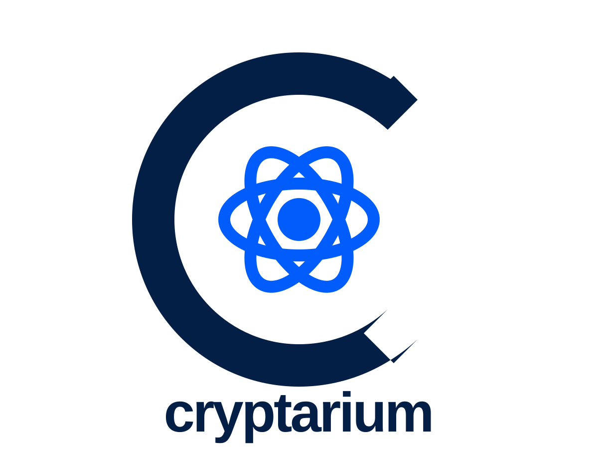

<p align="center">
  <picture>
    <source media="(prefers-color-scheme: dark)" srcset="docs/logo/dark.svg"/>
    
  </picture>
</p>


### **Cryptographic discovery and CBOM generation for the post-quantum transition.**


[](https://github.com/sgoveia/cryptarium/actions/workflows/ci.yml)
[](https://pkg.go.dev/github.com/sgoveia/cryptarium)
[](LICENSE)

`cryptarium` is a Go-based CLI that scans a local path or public HTTPS git URL for cryptography. It finds crypto in source, dependency manifests, certificates, and configuration; classifies each use by quantum exposure; and emits a standards-based **Cryptographic Bill of Materials (CBOM)** plus a prioritized migration report.

Unlike single-source scanners, it unifies all four evidence sources in one binary and **correlates** them, so a finding is a linked picture (dependency, source call, key or certificate, and config) rather than four disconnected lists.

You cannot migrate cryptography you cannot see. NIST, CISA, and CNSA 2.0 all start with inventory; `cryptarium` turns that into a CI-friendly scan of what your repository actually contains.

> **Status: v0.3.0: deep C/C++ rule packs (OpenSSL, libsodium, mbedTLS, Crypto++, Botan); embedded defaults + public HTTPS remote scan.** Release binaries and `go install` are self-contained (default `rules/` are embedded). Core detectors, correlation, scoring, CBOM/SARIF, and the GitHub Action ship on tagged releases. Interfaces may still evolve before 1.0. See [DESIGN.md](DESIGN.md) for architecture and [Roadmap](#roadmap) for what is next.

---

## At a glance

| Area | Supported today (v0.1) |
|---|---|
| **Targets** | Local directory, or public HTTPS git URL (shallow clone; requires `git` on `PATH`). SSH / private remotes: roadmap |
| **Source languages** | Go, Python, JavaScript / TypeScript, Java, C / C++ (tree-sitter + YAML rule packs) |
| **Dependency manifests** | Go only (`go.mod` + known-library catalog). Not yet: `requirements.txt`, `package-lock.json`, `pom.xml`, `Cargo.toml`, and peers |
| **Certificates & keys** | `.pem`, `.crt`, `.cer`, `.der`, `.key`, `.p12`, `.pfx` (X.509 / PKCS#12) |
| **Configuration** | nginx TLS cipher suites, SSH algorithm directives, JWT `alg` in auth-ish JSON/YAML |
| **Outputs** | Markdown (default), JSON, CycloneDX CBOM 1.6+, SARIF |
| **CI** | GitHub Action; `--fail-on critical\|high\|medium\|low` |

Source scanning covers Python, JS/TS, Java, and C/C++ call sites even when their package manifests are not read. Not scanned yet: non-Go dependency manifests, JKS keystores, OpenSSH private keys, binaries, containers, or live TLS negotiation. SSH and private/authenticated git remotes are on the roadmap.

---

## Features

- **Remote public repos:** shallow-clone an anonymous HTTPS git URL (requires `git` on `PATH`), then scan like a local tree
- **Multi-source inventory:** source calls, dependency manifests, certificates/keys, and config in one pass
- **Cross-source correlation:** links related findings (e.g. a library in `go.mod` and the call site that uses it) and raises confidence when evidence agrees
- **Quantum classification:** Broken (Shor), Weakened (Grover), or Safe/PQC, with a recommended migration target
- **Risk scoring:** prioritizes by algorithm vulnerability, data longevity, exposure surface, and crypto-agility
- **CI gating:** SARIF upload and `--fail-on` to fail builds on a severity threshold
- **Declarative rules:** add library or language coverage as YAML under [`rules/`](rules/) without changing the engine
- **Deterministic output:** same input, byte-identical CBOM/report (no silent gaps: unparseable files are warned)

---

## Language and rule coverage

Source detection uses tree-sitter parsing plus rule packs. Coverage is intentionally incomplete and grows by adding rules, not by claiming every crypto API in a language.

| Language | Rule pack | What it matches today |
|---|---|---|
| **Go** | [`rules/go/stdlib-crypto.yaml`](rules/go/stdlib-crypto.yaml) | `crypto/rsa.GenerateKey`, `crypto/ecdsa.GenerateKey`, `TLS_*_WITH_AES_128_*` identifiers |
| **Python** | [`rules/python/cryptography.yaml`](rules/python/cryptography.yaml) | `cryptography` RSA keygen, `hashlib.md5` |
| **JavaScript / TypeScript** | [`rules/javascript/webcrypto.yaml`](rules/javascript/webcrypto.yaml) | Node `crypto.createCipheriv`, `crypto.subtle.generateKey` (TS/TSX reuse the JS pack) |
| **Java** | [`rules/java/security.yaml`](rules/java/security.yaml) | `KeyPairGenerator.getInstance`, `Cipher.getInstance` (algorithm from string args) |
| **C / C++** | [`rules/c/openssl.yaml`](rules/c/openssl.yaml), [`rules/cpp/openssl.yaml`](rules/cpp/openssl.yaml) | OpenSSL `RSA_generate_key_ex`, `EVP_PKEY_keygen` |

**Dependency manifests (Go only in v0.1):** [`rules/libraries/catalog.yaml`](rules/libraries/catalog.yaml) flags known crypto modules in `go.mod` (e.g. `golang.org/x/crypto`, CIRCL, go-jose) at medium confidence until correlated with source. Python, JavaScript, Java, and C/C++ are covered via **source** rules above; their package managers are not parsed yet.

**Certificates:** signature algorithm, public-key algorithm, key size, curve, and validity from parsed X.509 / PKCS#12 material. Private key bytes are never emitted.

**Configuration:** nginx `ssl_ciphers` and bare `TLS_*`/`SSL_*` suite tokens; SSH `KexAlgorithms`, `HostKeyAlgorithms`, `Ciphers`, `MACs`; JWT `alg` in JSON/YAML whose basename suggests jwt/auth/security/token.

---

## Install

```bash
# Go 1.26+
go install github.com/sgoveia/cryptarium/cmd/cryptarium@v0.3.0
```

Pre-built binaries (linux/darwin/windows, amd64/arm64) are attached to [GitHub Releases](https://github.com/sgoveia/cryptarium/releases). Default rule packs ship **inside** the binary; you do not need a `rules/` directory beside it.

## Usage

```bash
# Scan the current directory
cryptarium scan .

# Scan a public HTTPS git repository (requires git on PATH)
cryptarium scan https://github.com/OWNER/REPO

# Emit a CycloneDX CBOM
cryptarium scan . --format cbom --output cbom.json

# Emit SARIF for GitHub code scanning
cryptarium scan . --format sarif --output results.sarif

# Human-readable migration report (default format)
cryptarium scan . --format markdown --output CRYPTO-REPORT.md

# Machine-readable JSON
cryptarium scan . --format json --output findings.json

# Fail CI when anything scores Critical
cryptarium scan . --fail-on critical
```

### Scan flags

```
Usage:
  cryptarium scan [flags] <path|git-url>

Flags:
  -concurrency int
        worker count (default: NumCPU)
  -deterministic
        suppress timestamps and machine-specific metadata
  -exclude value
        glob to exclude (repeatable)
  -fail-on string
        fail when priority reaches: critical|high|medium|low|none (default "none")
  -format value
        output format: json|cbom|sarif|markdown|html (repeatable)
  -include-tests
        include test files and fixtures at normal scoring
  -output string
        output path, or "-" for stdout
  -policy string
        path to a policy file
  -rules value
        additional rule-pack directory to load after defaults (repeatable)
  -v    verbose logging (shorthand)
  -verbose
        verbose logging
```

Run `cryptarium scan --help` for the same listing from the binary.

### Example output

```
# cryptarium report

Tool: cryptarium 0.0.0-dev

Findings: **4** · 2 critical · 2 high · 0 medium · 0 low

| Priority | Class | Location | Primitive | Recommendation |
|---|---|---|---|---|
| critical (83) | broken | `certs/ecdsa-p256.pem` | ECDSA | ML-DSA-65 (FIPS 204) |
| critical (83) | broken | `certs/rsa2048.pem` | RSA | ML-KEM-768 / ML-DSA-65 (FIPS 203 / FIPS 204) |
| high (70) | broken | `go.mod:6` | RSA | ML-KEM-768 / ML-DSA-65 (FIPS 203 / FIPS 204) |
| high (78) | broken | `token.go:9` | RSA | ML-KEM-768 / ML-DSA-65 (FIPS 203 / FIPS 204) |
```

### GitHub Action

```yaml
- uses: sgoveia/cryptarium@v0.3.0
  with:
    path: .
    fail-on: critical
    upload-sarif: true
```

---

## Classification and prioritization

Every finding is classified as **Broken** (defeated by Shor's algorithm), **Weakened** (reduced margin under Grover's), or **Safe/PQC**, and mapped to a recommended migration target:

| Classical primitive | Status | Recommended target |
|---|---|---|
| RSA | Broken (Shor) | ML-KEM (FIPS 203) for key establishment; ML-DSA (FIPS 204) for signatures |
| ECDH / DH | Broken (Shor) | ML-KEM; hybrid X25519 + ML-KEM-768 during transition |
| ECDSA / EdDSA / DSA | Broken (Shor) | ML-DSA (FIPS 204); SLH-DSA (FIPS 205) where a conservative hash-based option is preferred |
| AES-128 | Weakened (Grover) | AES-256 |
| SHA-256 | Weakened (Grover) | SHA-384 / SHA-512 in high-assurance contexts |
| SHA-1, MD5, 3DES | Already broken | Deprecate immediately |

Hybrid classical-plus-PQC constructions are a first-class recommended transition state.

Each finding is scored on four axes so the inventory is actionable:

1. **Algorithm vulnerability:** broken outranks weakened outranks safe
2. **Data longevity (HNDL exposure):** longer-lived secrets rank higher
3. **Exposure surface:** internet-facing vs. internal; in-transit vs. at-rest vs. code-signing
4. **Crypto-agility:** hardcoded primitives cost more to remediate than provider-backed ones

---

## What this is not

Credibility depends on never overstating what static discovery can prove.

- Not a cryptographic **correctness** auditor (padding, IV reuse, side channels)
- Not a binary, firmware, or container analyzer (roadmap)
- Not a runtime or network TLS scanner (roadmap); it sees what code and config *contain*, not what is negotiated on the wire
- Not a multi-ecosystem dependency scanner yet; only `go.mod` in v0.1
- Not a replacement for a cryptographer's judgment on migration design

---

## Roadmap

| Phase | Focus | Status |
|---|---|---|
| 0 | Scaffold: CLI skeleton, `CryptoFinding` model, CI, license | ✅ |
| 1 | Certificate/key + dependency-manifest detectors; JSON + Markdown output | ✅ |
| 2 | Rule-pack source detector (Go, Python, JS/TS, Java, C/C++; tree-sitter, no CGO); classifier; CBOM | ✅ |
| 3 | Risk scoring; SARIF; GitHub Action | ✅ |
| 4 | AI-assisted triage; multi-repo scanning; container images | ⬜ |

Near-term coverage expansion includes additional dependency ecosystems, deeper rule packs, and SSH / private (authenticated) remote git scanning. Longer roadmap: filesystem/container scanning, runtime/network discovery, binary analysis, org-wide aggregation, cloud KMS/HSM discovery, and export to more CI/GRC destinations.

`cryptarium` aims to own **code and CI discovery** (open CLI + GitHub Action producing an auditable CBOM), integrate with enterprise posture platforms via CBOM/SARIF/JSON, and treat runtime/network assurance as roadmap, not as something static analysis can claim today.

---

## Development

The repository ships a dev container (Codespaces or VS Code Dev Containers) with Go 1.26 and the usual toolchain.

```bash
make help      # list targets
make check     # fmt + lint + test (what CI runs)
make build     # -> bin/cryptarium
make selfscan  # scan this repo with the tool itself
```

See [DESIGN.md](DESIGN.md) for architecture and [AGENT.md](AGENT.md) for contribution conventions.

## Contributing

The highest-value contribution is **coverage**: a YAML rule pack in [`rules/`](rules/) plus fixtures in `testdata/`, not a Go change. Schema: [DESIGN.md](DESIGN.md#rule-pack-schema). Every new rule needs a positive and a negative fixture.

## References

- NIST **FIPS 203** (ML-KEM), **FIPS 204** (ML-DSA), **FIPS 205** (SLH-DSA)
- **CycloneDX** CBOM (spec 1.6+), **SARIF** (OASIS), **NSA CNSA 2.0**
- **NIST / CISA** post-quantum migration guidance: cryptographic inventory as the first step

## License

[Apache-2.0](LICENSE). The patent grant matters for cryptographic tooling.

See [DISCLAIMER.md](DISCLAIMER.md) for warranty and liability limits that apply to authors, maintainers, and contributors.
