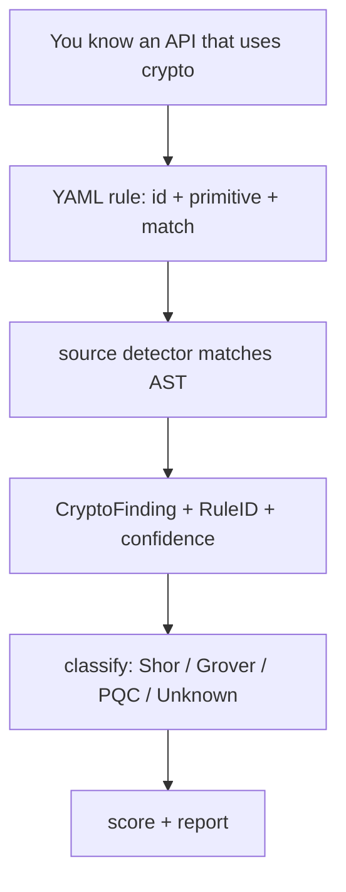

# Adding a rule

Coverage should be a YAML file plus fixtures — not a Go change — whenever the [rule schema](/detectors/rule-packs) is sufficient.

This page is a worked tutorial. It shows **why** each field exists, what the rule claims cryptographically (observation only), and how the hit flows through the app. Primary examples are **C/OpenSSL** and **JavaScript/Web Crypto** — the same packs that already ship in the repository.

## Mental model



The YAML never says “migrate to ML-DSA.” It says “this call site is RSA key generation” (or “unknown algorithm keygen”). Classification and migration targets live in `internal/classify` with FIPS/NIST citations.

## Contributor checklist

- [ ] Unique, stable `id` (renaming breaks SARIF baselines)
- [ ] Canonical `primitive` from [primitives](/reference/primitives) — or honest `UNKNOWN`
- [ ] Honest `confidence` — `high` only when the match establishes primitive *and* parameters
- [ ] Positive fixture that must match
- [ ] Negative fixture that must not (comment, similarly named non-crypto call)
- [ ] `references` to authoritative API docs
- [ ] `make lint-rules` passes; regenerate goldens only deliberately (`make golden`)

---

## Walkthrough A — Add a C/OpenSSL rule

### Why

OpenSSL’s RSA-specific keygen APIs are high-value inventory: they establish the primitive without guessing. Shor’s algorithm breaks RSA once classified; the rule’s job is to make sure the call site appears in the CBOM with evidence.

### Starting point

The shipped pack [`rules/c/openssl.yaml`](https://github.com/sgoveia/cryptarium/blob/main/rules/c/openssl.yaml) already includes:

```yaml
  - id: c.openssl.rsa_generate_key_ex
    primitive: RSA
    assetType: algorithm
    functions: [keygen]
    confidence: high
    match:
      kind: call
      package: openssl
      symbol: RSA_generate_key_ex
    references:
      - "https://www.openssl.org/docs/man3.0/man3/RSA_generate_key.html"
```

**Field rationale**

| Field | Choice | Why |
|---|---|---|
| `primitive: RSA` | Specific | The symbol name encodes RSA — not a generic EVP API |
| `functions: [keygen]` | Operation | Scorer treats keygen as longer-lived trust material than ephemeral encrypt |
| `confidence: high` | Strong | Match alone establishes primitive; bit length may still be missing |
| `package: openssl` | Disambiguation | C calls are often unqualified; the detector special-cases this package |
| `symbol` | Exact | AST must see this callee — comments with the same text must not match |

Contrast with the polymorphic neighbor in the same pack:

```yaml
  - id: c.openssl.evp_pkey_keygen
    primitive: UNKNOWN
    functions: [keygen]
    confidence: medium
    match:
      kind: call
      package: openssl
      symbol: EVP_PKEY_keygen
```

`EVP_PKEY_keygen` can produce RSA, EC, or other keys depending on the `EVP_PKEY_CTX` setup. Claiming `RSA` here would be a false assurance. `UNKNOWN` + medium confidence is the catholic answer.

### Adding a *new* OpenSSL symbol

Suppose you want to cover `EC_KEY_generate_key` (illustrative — follow the same pattern for any concrete symbol you confirm in OpenSSL docs):

1. Confirm the man page and the canonical primitive (`ECDSA` / `ECDH` as appropriate — if the API is curve-generic and you cannot tell, use `UNKNOWN`).
2. Append a rule to `rules/c/openssl.yaml` (and mirror in `rules/cpp/openssl.yaml` if you want an explicit C++ rule ID; remember **cpp files already load `c` packs** via alias).
3. Add fixtures under `testdata/rules/<rule-id>/`.

```yaml
  - id: c.openssl.ec_key_generate_key
    primitive: ECDSA
    assetType: algorithm
    functions: [keygen]
    confidence: medium   # API name says EC keygen; exact scheme may still be ambiguous
    match:
      kind: call
      package: openssl
      symbol: EC_KEY_generate_key
    references:
      - "https://www.openssl.org/docs/man3.0/man3/EC_KEY_generate_key.html"
```

<Info>
  Prefer `medium` when the C API names “EC” but not ECDSA vs ECDH vs a specific curve. Raise to `high` only when the symbol (or extracted parameters) leave no honest ambiguity. When unsure, `UNKNOWN` beats a wrong class.
</Info>

### Positive and negative fixtures (C)

**Positive** — real call the AST must see:

```c
#include <openssl/rsa.h>

int make_rsa(RSA *rsa, BIGNUM *e) {
    return RSA_generate_key_ex(rsa, 2048, e, NULL);
}
```

**Negative** — must *not* match:

```c
/* RSA_generate_key_ex is only mentioned in a comment. */
int make_rsa(void) {
    return 0;
}
```

Also consider a negative that *looks* similar but is not crypto (application function with a similar name). That is the fixture that keeps false-positive rates survivable.

### Crypto catholic reading

| Evidence | What the rule claims | What classify may conclude later |
|---|---|---|
| `RSA_generate_key_ex` | Site uses RSA key generation | **Broken** under Shor — migration toward ML-KEM / ML-DSA per product tables |
| `EVP_PKEY_keygen` | Site performs keygen of unknown algorithm | **Unknown** until correlated evidence exists |
| Bit length missing | Still emit the finding | Scorer/classifier work with incomplete params; do not invent `2048` |

---

## Walkthrough B — Add a JavaScript / Web Crypto rule

### Why

Node’s `crypto` and browser `crypto.subtle` are where many services mint keys and open ciphers. TypeScript files load **javascript** packs automatically, so one pack covers both.

### Starting point

From [`rules/javascript/webcrypto.yaml`](https://github.com/sgoveia/cryptarium/blob/main/rules/javascript/webcrypto.yaml):

```yaml
  - id: js.crypto.createcipheriv.aes
    primitive: AES
    assetType: algorithm
    functions: [encrypt]
    confidence: medium
    match:
      kind: call
      package: crypto
      symbol: createCipheriv
    references:
      - "https://nodejs.org/api/crypto.html#cryptocreatecipherivalgorithm-key-iv-options"

  - id: js.subtle.generatekey
    primitive: UNKNOWN
    assetType: algorithm
    functions: [keygen]
    confidence: low
    match:
      kind: call
      package: crypto.subtle
      symbol: generateKey
    references:
      - "https://developer.mozilla.org/en-US/docs/Web/API/SubtleCrypto/generateKey"
```

**Why `createCipheriv` is medium, not high:** the first argument selects the algorithm (`aes-256-gcm`, `aes-128-cbc`, …). The shipped rule does not yet extract that string into `parameters`, so claiming AES is a reasoned default for common usage — but not proof of key size. Grover’s algorithm weakens AES-128 and leaves AES-256 in a different band; without `keySize`, do not pretend you know which.

**Why `generateKey` is UNKNOWN / low:** Web Crypto’s `generateKey` is algorithm-polymorphic (`RSA-OAEP`, `ECDSA`, `AES-GCM`, …). Inventing `RSA` from the symbol alone would poison the inventory.

### Adding a *new* JS rule

Example: cover Node `generateKeyPairSync` when you only want to flag that asymmetric keygen occurred (algorithm still often passed as a string):

```yaml
  - id: js.crypto.generatekeypairsync
    primitive: UNKNOWN
    assetType: algorithm
    functions: [keygen]
    confidence: low
    match:
      kind: call
      package: crypto
      symbol: generateKeyPairSync
    references:
      - "https://nodejs.org/api/crypto.html#cryptogeneratekeypairsynctype-options"
```

If you later extract the `type` argument (`'rsa'`, `'ec'`, …) via `parameters.from: argument`, you can raise confidence and set a concrete primitive — **only** when extraction is implemented and fixtures prove it.

### Enhance an existing JS rule

Enhancement patterns (pick one change per PR when possible):

1. **Tighten confidence** after you add parameter extraction for the algorithm string.
2. **Add static parameters** only when every match truly shares them (rare for `createCipheriv`).
3. **Improve `package`** if false positives hit unrelated `createCipheriv` names — qualify imports correctly.
4. **Split rules** — separate `aes-128-*` vs `aes-256-*` identifier/call patterns if you match on string constants elsewhere.

Illustrative enhancement once argument capture works for JS:

```yaml
  - id: js.crypto.createcipheriv.aes
    primitive: AES
    functions: [encrypt, decrypt]
    confidence: high
    match:
      kind: call
      package: crypto
      symbol: createCipheriv
    parameters:
      algorithm:
        from: argument
        index: 0
        type: string
```

Until extraction is proven in fixtures, leave confidence at `medium` and do not claim `high`.

### Positive and negative fixtures (JS)

**Positive**

```js
const crypto = require("crypto");

function seal(key, iv, plain) {
  return crypto.createCipheriv("aes-256-gcm", key, iv).update(plain);
}
```

**Negative**

```js
// crypto.createCipheriv is only mentioned in a comment.
function seal() {
  return null;
}
```

TypeScript positive sites work against the same `javascript` pack — no separate pack required unless you introduce TS-only APIs.

### Crypto catholic reading

| Evidence | Rule claims | Classification later |
|---|---|---|
| `createCipheriv` | Likely AES encrypt API | Weakened vs Safe depends on key size when known |
| `subtle.generateKey` | Keygen, algorithm unknown | **Unknown** — correct until parameters exist |
| Algorithm string not captured | Still inventory the call | Prefer incomplete evidence over a wrong ML-KEM recommendation in YAML |

---

## Extend a pack vs new pack file

| Situation | Action |
|---|---|
| New symbol in the same library/ecosystem | Append a rule to the existing YAML |
| New language | New file under `rules/<lang>/` with its own pack `id` / `language` |
| C++-specific wrapper, not wanted on C | Put it in `rules/cpp/` only |
| Shared OpenSSL C API | Prefer `rules/c/` — cpp files already inherit `c` packs |

After editing YAML in a source checkout, scans that find on-disk `rules/` pick up changes without rebuild. Release binaries need a rebuild (or `--rules`) to permanently include new default packs in the embed.

## Extend the library catalog

Dependency presence is a different detector. Add a Go module to `rules/libraries/catalog.yaml`:

```yaml
  - name: github.com/example/pq-crypto
    ecosystem: go
    primitives: [ML-KEM, ML-DSA]
    notes: Concrete algorithms depend on imported subpackages.
    confidence: medium
```

Remember: as implemented, the deps detector consumes **`go.mod` + `ecosystem: go`** only. A PyPI name in the catalog does not yet produce findings. Confidence stays medium until [correlation](/concepts/correlation) with source.

## When *not* to write a rule

| Need | Prefer |
|---|---|
| Parse certificates / extract key sizes from PEM | `certs` detector |
| Split nginx `ssl_ciphers` | `config` detector |
| Cross-file dataflow (“this RSA key is used to sign JWT”) | Out of rule-pack scope; do not fake it |
| New match kind beyond `call` / `identifier` | Schema + Go change — ask before widening |

## Validate

```bash
make lint-rules
make test
make check
```

See [Fixtures & validation](/detectors/fixtures) for layout and golden discipline.

## Related

- [Rule packs](/detectors/rule-packs) — full field reference
- [Fixtures & validation](/detectors/fixtures)
- [Quantum classification](/concepts/classification)
- [Confidence & unknown](/concepts/confidence)
