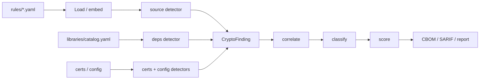

# Detectors overview

Detectors extract cryptographic **evidence**. They do not classify quantum exposure — that is the classifier's job after correlation and scoring.

**Why this matters:** A rule pack that claims "RSA is broken" inside YAML would mix inventory with policy. Cryptarium keeps those layers apart so the CBOM stays reproducible and every quantum claim stays citation-backed in Go.

## The four detectors

| Detector | Input | What it emits | Confidence ceiling |
|---|---|---|---|
| **Source** | Parsed source via YAML [rule packs](/detectors/rule-packs) (Go, Python, JS/TS, Java, C/C++) | Call sites, primitives, parameters, rule IDs | Up to `high` when the AST match establishes primitive *and* parameters |
| **Dependencies** | Lockfiles / manifests against [`rules/libraries/catalog.yaml`](https://github.com/sgoveia/cryptarium/blob/main/rules/libraries/catalog.yaml) | Crypto libraries present | **Medium** at most — presence is not proof of use |
| **Certificates** | PEM/DER/PKCS#12 (`.pem`, `.crt`, `.cer`, `.der`, `.key`, `.p12`, `.pfx`) | Algorithms, sizes, curves, validity (**metadata only**) | High when the cert parses cleanly |
| **Configuration** | nginx TLS suites, SSH algorithms, JWT `alg`, and similar | Configured suites and algorithms | Varies; one config line can yield several findings |

## How a finding is born

1. **Collect** files from the scan target.
2. **Detect** — each detector that `Handles` a file returns zero or more `CryptoFinding` values (path, line, primitive, parameters, evidence, rule ID, confidence).
3. **Correlate** — link related findings (for example a `go.mod` library and a matching source call). Correlation can raise confidence; it never invents a new finding or rewrites a primitive.
4. **Classify** — map the canonical primitive (and parameters) to Broken / Weakened / Safe-PQC / Unknown. See [Quantum classification](/concepts/classification).
5. **Score** — turn class + longevity/exposure/agility heuristics into a priority. See [Risk scoring](/concepts/scoring).
6. **Report** — CBOM, SARIF, Markdown/HTML, JSON.

## Design constraints

- Prefer AST / structured parsing over regex. Regex is an explicit fallback and **forces `low` confidence**.
- Never emit key material — metadata and redacted snippets only.
- Unparseable files must produce warnings; silent omission is the worst inventory bug.
- Static analysis cannot see runtime algorithm selection, dynamically loaded providers, or what is negotiated on the wire. The inventory must never imply otherwise.

## Rule packs vs Go detectors

Most **source** coverage is declarative YAML under `rules/`. Add a library idiom or API call there first. Write Go only when you need a real parser (certificates), format-aware config logic, or behavior outside the match schema.

| You want to… | Prefer |
|---|---|
| Detect `RSA_generate_key_ex` or `crypto.createCipheriv` | YAML rule pack |
| List `golang.org/x/crypto` in `go.mod` | Library catalog |
| Parse an X.509 certificate | `certs` detector (Go) |
| Split nginx `ssl_ciphers` into primitives | `config` detector (Go) |

## Related

- [Rule packs](/detectors/rule-packs) — field-by-field schema and load path
- [Adding a rule](/detectors/adding-a-rule) — C/OpenSSL and JavaScript walkthroughs
- [Fixtures & validation](/detectors/fixtures)
- [Four evidence sources](/concepts/evidence-sources)
- [Confidence & unknown](/concepts/confidence)
