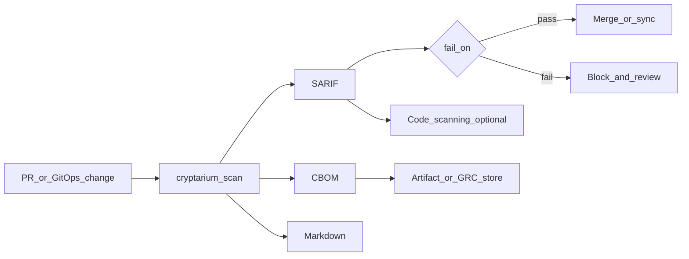
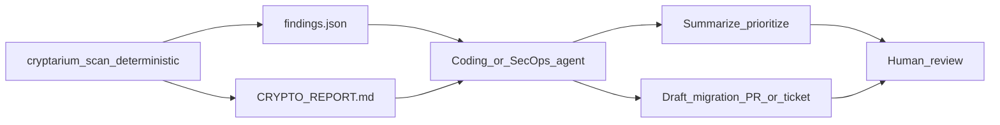

# CI/CD & workflow integration

Plug cryptarium into the pipelines you already run. It is a scan step that emits machine and human artifacts — SARIF, CBOM, JSON, Markdown — that CI gates, GitOps promote paths, and coding agents can consume.

**Why this matters:** Post-quantum migration needs a repeatable inventory in the same place you already block bad merges and open fix work. Cryptarium does not replace your orchestrator; it feeds it.

## Which artifact for which consumer

| Pattern | Primary artifact | Next step |
|---|---|---|
| PR / merge gate | SARIF + `--fail-on` | Fail the job; optional Code scanning alerts |
| Compliance / inventory archive | CBOM (+ Markdown) | Retain artifact; CycloneDX / GRC ingest |
| Custom automation | JSON | Scripts, bots, internal APIs |
| Human / architect handoff | Markdown report | Ticket, review, migration plan |
| Agentic triage / fix drafts | JSON or Markdown (`--deterministic`) | Agent prompt + optional PR |

Pin CLI and Action refs to a tagged release (examples use `v0.3.0`).

---

## Traditional CI and GitOps



### GitHub Actions PR gate

Full job: gate on severity and upload SARIF to Security → Code scanning.

```yaml
name: cryptarium

on:
  pull_request:
  push:
    branches: [main]

permissions:
  contents: read
  security-events: write

jobs:
  crypto-inventory:
    runs-on: ubuntu-latest
    steps:
      - uses: actions/checkout@v4

      - uses: sgoveia/cryptarium@v0.3.0
        with:
          path: .
          fail-on: critical
          upload-sarif: true
```

Start with `critical`, then tighten to `high` once the backlog is under control. Inputs and upload behavior: [GitHub Action](/cli/github-action), [Uploading SARIF](/guides/sarif-upload), [CI with --fail-on](/guides/ci-fail-on).

### GitOps / scheduled inventory

Scan the **application or infra repo** that Argo CD, Flux, or similar syncs from — not the live cluster. Cryptarium inventories source, deps, certs, and config in that tree.

```yaml
# Example: nightly inventory + retain CBOM / report (no gate yet)
name: crypto-inventory

on:
  schedule:
    - cron: "0 6 * * 1"
  workflow_dispatch:

jobs:
  inventory:
    runs-on: ubuntu-latest
    steps:
      - uses: actions/checkout@v4

      - uses: actions/setup-go@v5
        with:
          go-version: "1.26"

      - name: Install cryptarium
        run: go install github.com/sgoveia/cryptarium/cmd/cryptarium@v0.3.0

      - name: Scan
        run: |
          mkdir -p out
          cryptarium scan . \
            --format cbom \
            --format markdown \
            --format sarif \
            --output out/ \
            --deterministic \
            --fail-on none

      - uses: actions/upload-artifact@v4
        with:
          name: cryptarium-inventory
          path: out/
```

Add `--fail-on critical` (or wire the Action) on the promote path when you are ready to block syncs that still ship broken primitives.

### Generic CI / GitLab

There is no first-party GitLab or Jenkins Action. The CLI is the integration surface — `go install` a tag or download a release binary (rule packs are embedded).

```yaml
# .gitlab-ci.yml
cryptarium:
  image: golang:1.26
  stage: test
  script:
    - go install github.com/sgoveia/cryptarium/cmd/cryptarium@v0.3.0
    - mkdir -p out
    - >
      cryptarium scan . \
        --format sarif --format cbom --format markdown \
        --output out/ \
        --fail-on critical
  artifacts:
    when: always
    paths:
      - out/
  allow_failure: false
```

Exit codes: `0` success, `1` threshold met, `2` scan error. Artifacts are written before a threshold failure. See [Flags & exit codes](/cli/flags).

---

## Agentic workflows

<Info>
Cryptarium does not ship an MCP server or agent runtime. Agents and SecOps bots consume **files the CLI already writes**. Optional AI triage (Phase 4 roadmap) will annotate only — it must never create, delete, or reclassify findings, and the CBOM must stay identical with enrichment on or off.
</Info>



### Pipeline produces agent inputs

Emit stable JSON and Markdown in CI (alongside SARIF for humans and gates):

```bash
mkdir -p out
cryptarium scan . \
  --format json \
  --format markdown \
  --format sarif \
  --output out/ \
  --deterministic \
  --fail-on none
```

Upload `out/` as a job artifact so a follow-on agent job, local Cursor/Claude session, or SecOps bot can fetch the same bytes every run. Prefer `--deterministic` whenever IDs or diffs feed automation.

### Cursor / Claude Code loop

After a local or CI scan:

1. Point the agent at `out/CRYPTO-REPORT.md` or `out/cryptarium.json` (default JSON name when `--output` is a directory).
2. Use a fixed prompt that forbids inventing crypto claims:

```text
You are triaging a cryptarium inventory. Read out/CRYPTO-REPORT.md (or the JSON).
Only discuss findings that are critical or high priority.
For each: cite file:line, primitive, classification, and the migration target
already on the finding. Do not invent algorithms, key sizes, or OIDs.
Propose a minimal code or config change PR plan; do not claim the change is
cryptographically verified.
```

3. Human-review any draft PR before merge — the agent drafts; the inventory remains the source of truth.

### SecOps bot pattern

On SARIF or JSON (webhook, cron, or Actions `workflow_run`):

- Open or update issues for `critical` / `high` only.
- Attach a short Markdown excerpt (location, class, recommended target, confidence).
- Dedupe on stable finding IDs from deterministic scans.

Do not let a bot reclassify or drop findings; that stays in cryptarium’s cited classifier.

---

## Recommended rollout

1. **Inventory only** — `--fail-on none`; retain SARIF + CBOM + Markdown.
2. **Gate critical** — `--fail-on critical` on default branch or promote.
3. **Tighten** — move to `high` when the backlog is manageable.
4. **Optional agents** — same artifacts into triage / draft-PR loops under human review.

## What not to expect

- No published Docker image for the CLI (container *scanning* is roadmap).
- `--policy` is accepted but unused today (stub).
- No first-party GitLab or Jenkins plugin — use the CLI.
- The GitHub Action inputs today: `path`, `fail-on`, `format` (`markdown|json|cbom`), `output`, `upload-sarif` — not multi-format or CBOM upload as first-class inputs.
- Static analysis cannot see runtime algorithm selection or wire negotiation. See [Limitations](/reference/limitations).

## Related

- [CI with --fail-on](/guides/ci-fail-on)
- [Uploading SARIF](/guides/sarif-upload)
- [GitHub Action](/cli/github-action)
- [Flags & exit codes](/cli/flags)
- [CBOM](/outputs/cbom) · [JSON](/outputs/json) · [SARIF](/outputs/sarif)
- [Risk scoring](/concepts/scoring) · [Determinism](/concepts/determinism)
